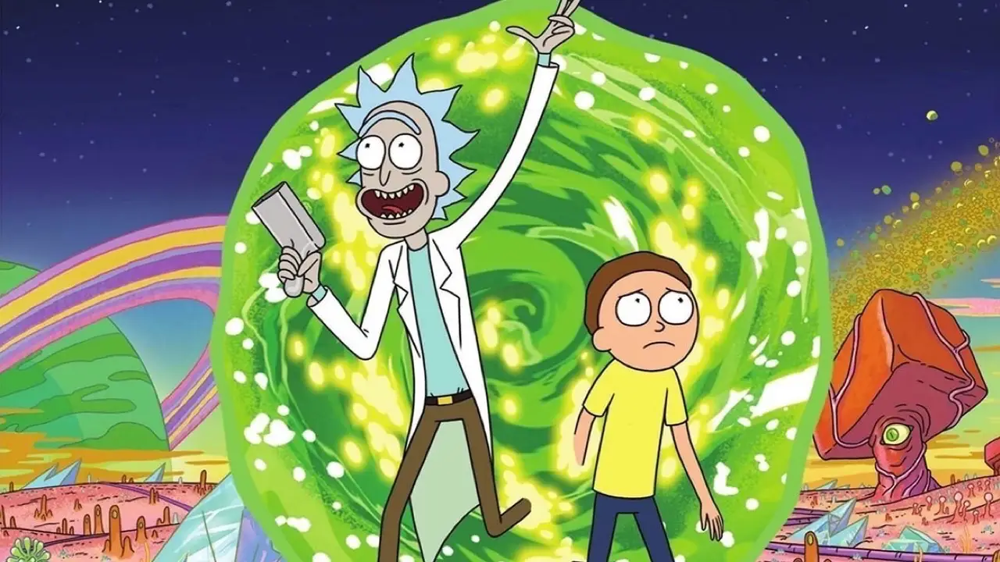
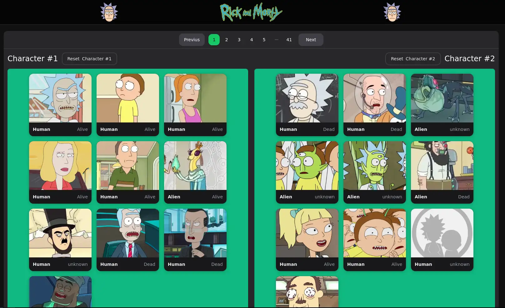
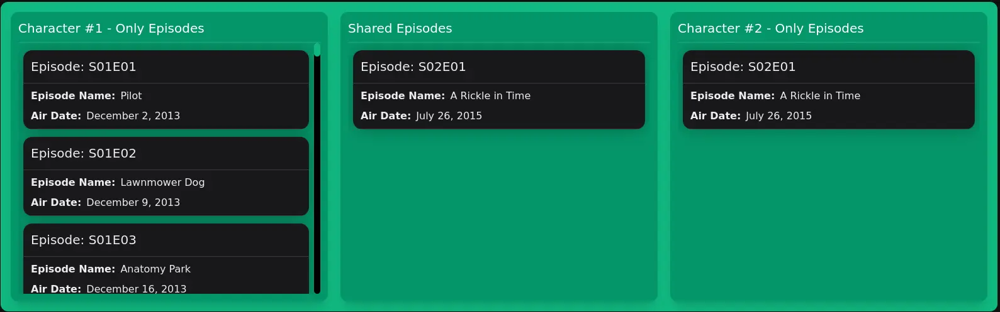

# Rick and Morty API Challenge

This is a Next.js project that utilizes the [Rick and Morty API](https://rickandmortyapi.com/) to fetch and display information about characters and episodes, from the Rick and Morty TV show.



## Table of Contents

- [Demo](#demo)
- [Features](#features)
- [Extras](#extras)
- [Getting Started](#getting-started)
  - [Requirements](#requirements)
  - [Installation](#installation)
- [Technologies](#technologies)
- [Screenshots](#screenshots)

## Demo

[Live Demo](https://ricky-and-morty-frontend-challenge.vercel.app/)

## Features

- View all characters.
- Select two characters to view the episodes of each one and the shared episodes between them.
- Responsive design for various screen sizes.

## Extras

- Tutorial explaining how to use the app once the user arrive to the page. The user desicion is saved for the future.

## Getting Started

### Requirements

- Node.js and a package manager installed on your machine.

### Installation

1. Clone the repository:

   ```bash
   git clone https://github.com/nicocarballo21/ricky-and-morty-frontend-challenge.git
   ```

2. Install dependencies:

   ```bash
   yarn install
   ```

   or

   ```bash
   npm install
   ```

3. Run the development server:

   ```bash
   yarn run dev
   ```

   or

   ```bash
   npm run dev
   ```

## Technologies

List of tools, frameworks, libraries, or APIs used in the project.

- [Next.JS](https://nextjs.org/) - The React Framework for the Web
- [ESLint](https://eslint.org/) - A pluggable and configurable linter tool for identifying and reporting on patterns in JavaScript code.
- [Tailwind CSS](https://tailwindcss.com/) - A utility-first CSS framework for quickly building custom designs without writing CSS from scratch.
- [Rick and Morty API](https://rickandmortyapi.com/) - The Rick and Morty API is a RESTful and GraphQL API based on the television show Rick and Morty.
- [TanStack Query](https://tanstack.com/query/v3/) - Powerful asynchronous state management for TS/JS, React, Solid, Vue and Svelte
- [TypeScript](https://www.typescriptlang.org/) - TypeScript is a strongly typed programming language that builds on JavaScript, giving you better tooling at any scale.
- [webp Images](https://developers.google.com/speed/webp?hl=es-419) - WebP is a modern image format that provides superior lossless and lossy compression for images on the web.

## Screenshots



